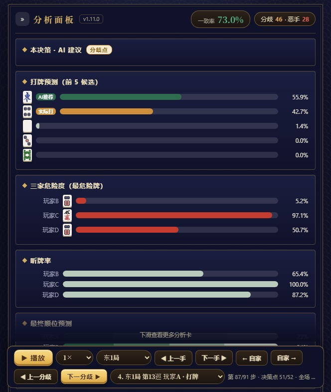
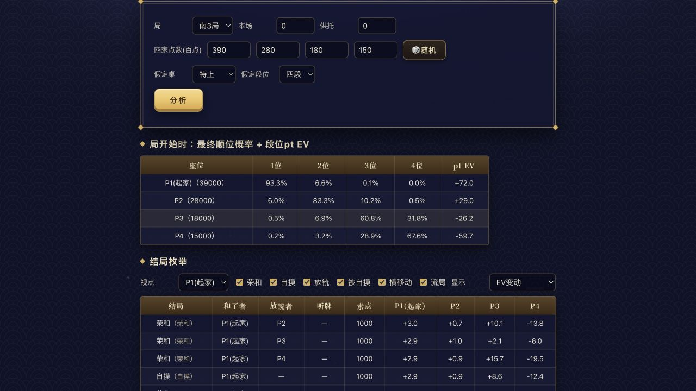
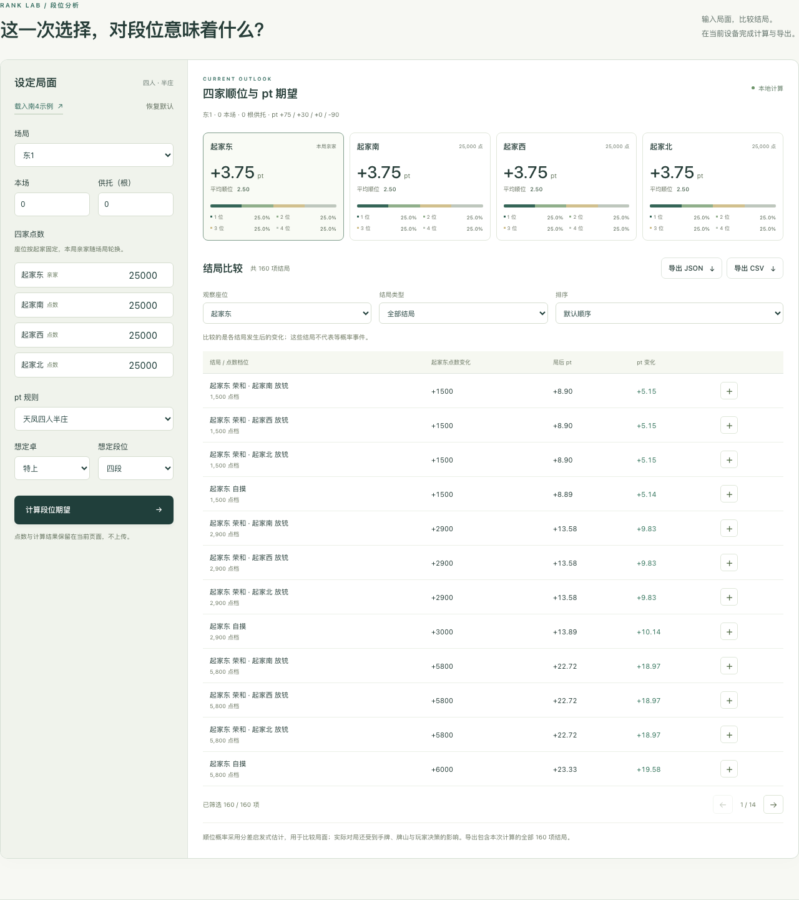

[简体中文](README.md) | [繁體中文](README.zh-TW.md) | [English](README.en.md)

# 日本麻將段位 pt 計算器

**依天鳳官方東南戰 pt 表，估計四家順位機率與 pt 期望 · 純前端、離線可跑**

輸入場局、本場、供託與四家點數，選擇想定卓與段位，得到順位機率、pt 期望，以及 160 項代表性結局的對比。

**適用範圍（先看這條，免得白跑一趟）：只支援天鳳的東南戰（半莊）四人麻將。** pt 表取自天鳳官方「段級位制 ■４人打ち」。三人麻將與東風戰都不支援；雀魂與雀姬的段位分除順位點外還要計入終局素點，公式與 pt 表都與本儲存庫不同，因此也不適用。

本儲存庫由**聽雀 TingQue**（[tingque.ai](https://tingque.ai/)）開源。聽雀另有 AI 牌譜復盤、第一打模擬、局面逆推與 AI 陪練，見下方「五項核心能力」——**那四項的伺服端模型與推理系統不在本儲存庫內**，儲存庫裡可獨立執行的只有段位分析。

**聽雀 · 真實牌譜復盤報告**


圖為公開天鳳牌譜在聽雀網站實際解析後的介面，已開啟匿名顯示；展示東1第13巡的實際打牌與AI推薦對照。下載版介面見下方本機段位分析。

## 五項核心能力

| 功能 | 能力說明 |
| --- | --- |
| **AI 牌譜復盤** | 天鳳、雀魂連結與雀姬分享碼；四麻、三麻；逐手候選與推薦度、分歧與惡手、聽牌率、危險度、順位預測、整局回放與分享；四麻支援多種策略風格。 |
| **段位分析** | 輸入場局、本場、供託、四家點數、假定牌桌與段位，估計順位分布與 pt 期望，比較160項代表性結局；支援自訂pt、篩選與匯出。 |
| **第一打模擬** | 為莊家的第一打選擇1–4張候選牌，讓AI分別展開實打模擬，比較得點期望、和牌率、放銃率與順位分布。 |
| **局面逆推** | 在四麻報告中，根據公開資訊推測至少兩組副露的對手手牌，列出最多40種候選，以及向聽、待牌與點數參考。 |
| **AI 陪練** | 呼叫1–4個AI進行四人東風或半莊對局，分別選擇平衡、門清進攻、副露進攻或防守風格。 |



上圖是同一決策點的真實分析面板，包含候選推薦、危險度與聽牌率；圖中百分比對應這一局面的估計。

**聽雀 · 段位分析實測**



在官網輸入南3局、39,000／28,000／18,000／15,000點，選擇特上四段後實際計算所得。操作與截圖來源見[截圖說明](docs/screenshots.md)。

## 模型與分析深度

聽雀的AI分析將推薦選擇與具體局面相連：逐手候選、分歧定位、風險估計、順位預測與不同策略風格可相互對照。模擬結果與手牌逆推提供進一步研究的線索；AI估計並不等於確定答案，也不承諾特定勝率或段位提升幅度。

牌譜復盤支援天鳳、雀魂的四麻與三麻連結，以及雀姬中國大陸伺服器的四麻與三麻分享碼。三麻使用平衡風格，聽牌率標記立直者、危險度為綜合估計；第一打模擬、局面逆推、AI陪練與本儲存庫的段位分析適用於四麻。

本儲存庫開源**工具前端、可獨立執行的段位分析引擎、Python參考實作及配套測試**。另外四項能力透過頁面中的對應入口連至TingQue；其伺服器端模型與推論系統不包含在此儲存庫中。

## 立即使用段位分析

使用發行套件 `tingque-open-tool-v0.1.4-web.zip`，解壓縮後按兩下 `index.html`，即可在瀏覽器本機計算。無須安裝Python或Node.js。離線狀態可完成段位分析及JSON/CSV匯出；TingQue功能入口需要網路連線。

1. 設定場局、本場、供託與以起家為基準固定座位的四家點數。
2. 選擇天鳳四人半莊pt，或自訂四個順位的pt。
3. 點擊「计算段位期望」，比較順位機率、pt與各結局變化。
4. 可切換觀察座位、篩選結局、排序、展開詳細資訊；匯出一律包含全部160項。

預設為東1、四家25,000點、特上四段，四個順位各25%，每家期望為 **+3.75 pt**。修改輸入後會提示重新計算；點數與結果保留在目前頁面，不會上傳。網頁介面使用簡體中文，上述按鈕名稱與實際介面一致。

**開源下載版 · 本機段位分析**



上圖來自本儲存庫執行後的介面，與網頁套件中的本機段位分析對應。

## 前端開發與建置

建議使用 **Node.js 24**；支援22系列的Node.js 22.13以上版本，或24系列。在儲存庫根目錄執行：

```bash
npm ci
npm run dev
```

開啟終端機顯示的本機網址。建置標準靜態網站與單一檔案版本：

```bash
npm run build
npm run build:standalone
npm run preview
```

`dist/`用於靜態網站託管，`dist-standalone/index.html`可直接按兩下開啟。一般的`dist/index.html`應透過靜態伺服器存取。所有字型均使用系統字型，段位計算不依賴外部API。

## Python程式庫與命令列

需要Python **3.10以上版本**，執行時不依賴第三方套件。macOS/Linux：

```bash
python3 -m venv .venv
source .venv/bin/activate
python -m pip install -e '.[test]'
rankpt analyze examples/request.json > result.json
python -m pytest -q
```

Windows可用`py -m venv .venv`建立環境，再以`.venv\Scripts\python.exe`取代`python`；命令列程式為`.venv\Scripts\rankpt.exe`。也可執行`python -m rankpt.cli analyze examples/request.json`；省略檔案或填入`-`即可從標準輸入讀取JSON。輸入統一以UTF-8讀取，檔案與標準輸入均支援UTF-8 BOM；輸出與錯誤也統一使用UTF-8。輸入錯誤會寫入標準錯誤並回傳結束代碼2。整數值可採用`0.0`或`2.5e4`等JSON數值寫法；布林值、非整數與無窮值仍會被拒絕。

```python
from rankpt import analyze

result = analyze({
    "kyoku_idx": 0, "honba": 0, "kyotaku": 0,
    "scores": [25000, 25000, 25000, 25000],
    "table": "特上", "dan": "四段"
})
print(result["pt_ev"])  # 約 [3.75, 3.75, 3.75, 3.75]
print(len(result["endings"]))  # 160
```

## 計算原理

順位估計採用Plackett–Luce啟發式模型，溫度為`2000 × max(8 − kyoku_idx, 1)`，依點差彙總24種終局順序；pt期望為各順位機率乘以對應pt後的總和。它不使用牌譜AI模型。

160項結局由 **108項榮和 + 36項自摸 + 16項流局** 組成。每項輸出點數轉移、局後狀態、四家順位與pt變化。這些結局沒有各自的發生機率，不能以等權重平均當作策略收益。

內建pt依據[天鳳官方四人東南戰表](https://tenhou.net/man/#DAN)。自摸採用等價總點數分攤，並將各筆支付向上取整至100點；未依符、翻實作完整支付表。詳細的[輸入規格、演算法與規則邊界](docs/algorithm.md)以簡體中文說明。

## 專案結構

```text
src/content/          五項能力的文案與入口
src/components/       輸入、圖表、結局表與頁面元件
src/domain/           TypeScript計算引擎、匯出與測試
src/App.tsx           產品頁面
rankpt/engine.py      Python參考引擎
rankpt/rules.py       pt與點數常數
rankpt/cli.py         JSON命令列程式
fixtures/ examples/   對照案例與可執行的輸入範例
scripts/              跨語言比對、文案檢查與發行打包
tests/                瀏覽器驗收
docs/                 演算法說明與實際介面截圖
```

## 檢查與發行套件

先準備上述Python環境，再執行：

```bash
python -m pytest -q
npm run verify
npx playwright install chromium firefox webkit
npm run test:browser
npm run package:release
```

`verify`依序執行lint、型別檢查、單元與介面測試、Python/TypeScript逐欄位比對、公開文案檢查、真實建置的發行回歸測試，以及兩種建置。比對包含7組固定輸入、涵蓋全部12個場局的100組固定種子輸入，以及8組原始JSON邊界輸入；每組有效輸入都檢查全部160項結局，絕對誤差上限為`1e-12`。Windows執行比對前可設定`$env:PYTHON='.venv\Scripts\python.exe'`；macOS/Linux可使用`export PYTHON="$PWD/.venv/bin/python"`。

瀏覽器測試在Chromium、Firefox與WebKit中涵蓋桌面、行動裝置寬度、文字對比度、鍵盤錯誤提示、匯出，以及離線`file://`執行。直接開啟原始碼的HTML時會顯示啟動說明。

`package:release`先將發行清單中的檔案複製到暫存目錄，只用這份待封裝的原始碼建置單一檔案網頁，再於`release/`產生原始碼ZIP、網頁ZIP與SHA-256清單；建置警告會阻止發行。打包時核對原始碼與HTML指紋、版本、隔離建置記錄及路徑，拒絕缺少資源、過期建置或符號連結。`build:standalone`用於日常建置；直接執行Python打包只接受由`package:release`產生且未被更動的成品。修改原始碼、文件或截圖後，請重新執行`npm run package:release`。GitHub Actions提供自動檢查設定；GitCode可使用相同的本機命令。

## 模型假設

僅支援四人半莊；不讀取手牌、牌山或玩家實力。南4起，最高分達到30,000點即依簡化規則結束；西4強制結束，同分依起家座位順序優先。未實作飛人結束、途中流局、多家和了、完整連莊終局分支，以及終局剩餘供託分配。160項為代表性結局，並非全部實戰可能。

因此，本機結果適合局面比較、教學與研究，不作為正式計分器或經實戰校準的勝率預測。兩種實作一致，不代表模型機率與真實對局機率一致。

## 貢獻與授權

歡迎改進模型、規則與介面，詳見[貢獻說明](CONTRIBUTING.md)。儲存庫的程式碼及文件採用[MIT License](LICENSE)，第三方元件詳見[授權聲明](THIRD_PARTY_NOTICES.md)；授權範圍不包含外部服務的模型與推論系統。
